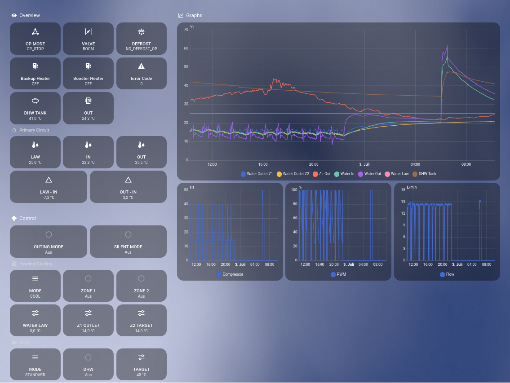

# 1 - TCP-HASS-BRIDGE

Check [Hardware](HARDWARE.md) documentation how to setup TCP connection

### [Config](cfg/tcp_hass_bridge.json)
| Parameter | Default Value | Description |
| ------- | ------- | ---- |
| tcp::address | 192.168.178.178.25 | address of the tcp server |
| tcp::port | 26 | port number of the tcp server |
| mqtt::address | localhost | address of the mqtt server |
| mqtt::port | 1883 | port number of the mqtt server |
| mqtt::client_id | tcp_hass_bridge | client_id of the mqtt client |
| read_msg_list | /etc/nasa-cpp/AE08BXYDGG-MIM03EN/sensor_msg_list.json | file path to the sensor msg list |
| request_msg_list | /etc/nasa-cpp/AE08BXYDGG-MIM03EN/control_msg_list.json | file path to the control msg list |
| write_msg_list | /etc/nasa-cpp/AE08BXYDGG-MIM03EN/fsv_msg_list.json | file path to the fsv msg list |
| read_only | false | only receive data, do not send any data |
| disable_write_send | true | safety guard, disable sending WRITE message (for example to change FSV values) |
| initial_read_out | true | after starting tcp_hass_bridge, for all NASA message a READ packet will be send to read out values |
| timeout | 30 (s) | set timeout in seconds, after reconnect is triggered |
| buffer_limit | 10000 | buffer limit in bytes, after which the buffer is cleared (this should never happen) |

### Run
Check command is set to ```tcp_hass_bridge``` in [compose.yml](compose.yml), then
```
docker compose up -d
```

### [Example dashboard](res/example-dashboard.yaml)
An example dashboard is provided, for full functionality additional [sensors](res/example-sensors.yaml) are necessary!



# 2 - TCP-FSV-LIST
Read out all field setting values and export them to a csv file.

### [Config](cfg/tcp_fsv_list.json)

### Run
```
docker run --network host -v ./:/host -w /host nasa-cpp:latest tcp_fsv_list
```

