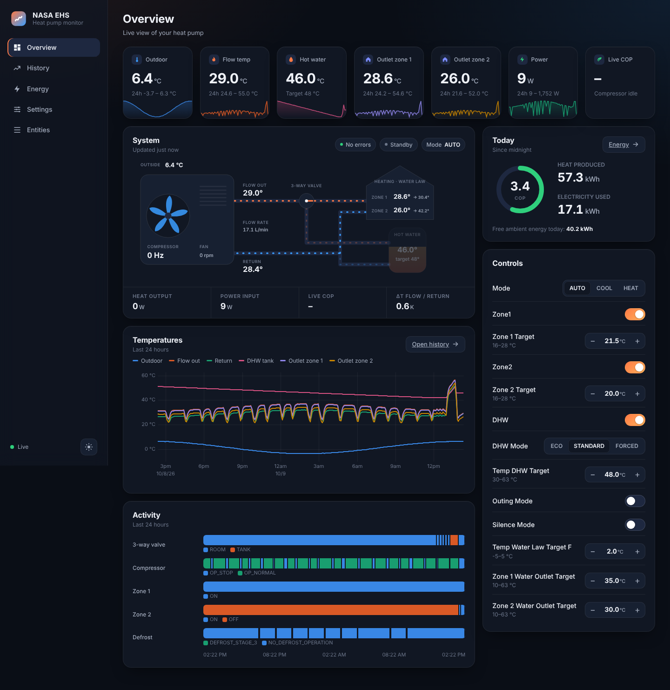

# nasa-cpp

[](LICENSE)
[](https://en.cppreference.com/w/cpp/20)
[](https://www.linux.org/)

A C++20 implementation of the Samsung NASA protocol for monitoring and controlling Samsung EHS
heat pumps. nasa-cpp talks to the heat pump's RS485 bus through a network serial adapter and
publishes its data to MQTT, with Home Assistant discovery. A standalone web dashboard with long-term
history is included as well.



## Contents

- [Overview](#overview)
- [Applications](#applications)
- [Supported devices](#supported-devices)
- [Getting started](#getting-started)
- [Configuration](#configuration)
- [Building from source](#building-from-source)
- [Repository layout](#repository-layout)
- [Documentation](#documentation)
- [Contributing](#contributing)
- [Credits](#credits)
- [Disclaimer](#disclaimer)
- [License](#license)

## Overview

```
Samsung heat pump ─ RS485 (NASA bus) ─ RS485/TCP adapter ─ LAN ─ nasa-cpp ─ MQTT broker ─┬─ Home Assistant
                                                                                       └─ nasa-web dashboard
```

- **Protocol library**: encoding and decoding of NASA packets and messages (`src/`).
- **MQTT bridge**: sensors, switches, selects and numbers are announced through Home Assistant MQTT
  discovery and are read from and written to the heat pump.
- **Configurable message lists**: which values are read, requested or written is defined in JSON files
  (`msg/`), so other models can be supported without code changes.
- **Safety switches**: a read-only mode, and a separate guard that blocks writes of field setting
  values (FSV).
- **Docker images** for `linux/amd64` and `linux/arm64`, published to
  `ghcr.io/sebastianeger/nasa-cpp`.

## Applications

| Application | Purpose | Documentation |
|---|---|---|
| `tcp_hass_bridge` | Bridges the heat pump to MQTT / Home Assistant (monitoring and control) | [APPS.md](APPS.md#1-tcp_hass_bridge) |
| `tcp_fsv_list` | Reads all field setting values (FSV) once and exports them to CSV | [APPS.md](APPS.md#2-tcp_fsv_list) |
| `tcp_nasa_logger` | Logs all decoded NASA packets to a file, for analysis and debugging | [APPS.md](APPS.md#3-tcp_nasa_logger) |
| `nasa-web` | Standalone web dashboard with history, energy statistics and controls | [web/README.md](web/README.md) |

## Supported devices

The message definitions in [`msg/AE08BXYDGG-MIM03EN`](msg/AE08BXYDGG-MIM03EN) were created and tested
on a Samsung EHS Mono HQ Quiet (`AE08BXYDGG`). Other heat pumps that use the NASA protocol are likely
to work, but supported message numbers, value ranges and options can differ between models. Check the
values before you enable any write access.

A network-attached RS485 adapter is required. See [HARDWARE.md](HARDWARE.md) for supported adapters,
wiring and adapter settings.

## Getting started

### 1. Connect the hardware

Wire an RS485-to-Ethernet/Wi-Fi adapter to the heat pump and configure it as a TCP server, as
described in [HARDWARE.md](HARDWARE.md).

### 2. Configure

Clone the repository and adjust the configuration files in `cfg/`:

```bash
git clone https://github.com/SebastianEger/nasa-cpp.git
cd nasa-cpp
```

At minimum, set `tcp.address` and `tcp.port` to your adapter. For the bridge, also set the MQTT broker in
`cfg/tcp_hass_bridge.json`. All options are listed in [APPS.md](APPS.md).

### 3. Run

The provided [`compose.yml`](compose.yml) runs the published image with host networking and mounts
`cfg/` and `logs/`. Select the application with `command`:

```yaml
services:
  nasa-cpp:
    image: ghcr.io/sebastianeger/nasa-cpp:main
    command: tcp_hass_bridge   # tcp_hass_bridge | tcp_fsv_list | tcp_nasa_logger
```

```bash
docker compose up -d nasa-cpp          # heat pump bridge
docker compose up -d nasa-web          # optional: web dashboard on http://<host>:8080
docker compose logs -f nasa-cpp
```

You can also start an application directly with `docker run`:

```bash
docker run --rm --network host -v ./cfg:/etc/nasa-cpp/cfg:ro \
    ghcr.io/sebastianeger/nasa-cpp:main tcp_hass_bridge
```

For Home Assistant, an example dashboard and additional sensors (daily energy and COP) are described
in [res/README.md](res/README.md).

## Configuration

Each application reads a JSON configuration file. The default path is
`/etc/nasa-cpp/cfg/<application>.json`; another path can be passed as the first command-line argument.

```
cfg/                                  → /etc/nasa-cpp/cfg
├── tcp_hass_bridge.json              # TCP adapter, MQTT broker, message lists, safety options
├── tcp_fsv_list.json                 # TCP adapter, FSV message list
└── tcp_nasa_logger.json              # TCP adapter, timeouts
msg/                                  → /etc/nasa-cpp/msg (included in the image)
└── AE08BXYDGG-MIM03EN/
    ├── sensor_msg_list.json          # values that are read (sensors)
    ├── control_msg_list.json         # values that are requested and can be set (controls)
    └── fsv_msg_list.json             # field setting values
```

Each message list entry maps a NASA message number to a Home Assistant entity:

```json
{
    "name": "Temp DHW Target",
    "message_number": "0x4235",
    "hass": {
        "type": "number",
        "device_class": "temperature",
        "unit_of_measurement": "°C",
        "value_template": "{{ (value | float) / 10 }}",
        "command_template": "{{ value * 10 }}",
        "min": 30,
        "max": 63,
        "step": 1
    }
}
```

`type` can be `sensor`, `binary_sensor`, `switch`, `select` or `number`. Enumerations (`select`, or
`sensor` with `"device_class": "enum"`) take an `options` object that maps each label to its raw value.
To use modified message lists without rebuilding the image, mount your own `msg/` directory to
`/etc/nasa-cpp/msg` (see the commented line in `compose.yml`).

## Building from source

### Docker

```bash
docker compose build                         # static release image (target: image-static)
docker build --target dev -t nasa-cpp:dev .  # development image with all dependencies
```

The development image is also used by the dev container configuration in `.devcontainer/`.

### Native

Requirements:

| Dependency | Version |
|---|---|
| C++ compiler | C++20 support (GCC 11+ or Clang 14+) |
| CMake | ≥ 3.12 |
| Ninja | any recent version |
| [Eclipse Paho MQTT C++](https://github.com/eclipse/paho.mqtt.cpp) | 1.5.2 (with Paho MQTT C) |
| [spdlog](https://github.com/gabime/spdlog) | 1.15.2 |
| [nlohmann/json](https://github.com/nlohmann/json) | 3.12.0 |

```bash
cmake -B build -G Ninja -DCMAKE_BUILD_TYPE=Release
cmake --build build
sudo cmake --install build      # installs binaries, cfg/ to /etc/nasa-cpp/cfg and msg/ to /etc/nasa-cpp/msg
```

| CMake option | Default | Description |
|---|---|---|
| `BUILD_SHARED_LIBS` | `ON` | Build the library as a shared library; `OFF` links the applications statically |
| `NASACPP_BUILD_TESTS` | `ON` | Build the unit tests (GoogleTest is downloaded at configure time) |
| `NASACPP_BUILD_SAMPLES` | `ON` | Build the sample programs in `samples/` |

Tests and samples are only built with `BUILD_SHARED_LIBS=ON`. To run the tests:

```bash
ctest --test-dir build --output-on-failure
```

## Repository layout

```
apps/        applications (tcp_hass_bridge, tcp_fsv_list, tcp_nasa_logger)
src/         NASA protocol library, TCP and MQTT clients, Home Assistant bridge
msg/         message lists per heat pump model
cfg/         application configuration files
samples/     small example programs using the library
test/        unit tests (GoogleTest)
web/         nasa-web dashboard (Python backend and web frontend)
res/         Home Assistant examples and screenshots (see res/README.md)
```

## Documentation

- [APPS.md](APPS.md): applications and all configuration options
- [HARDWARE.md](HARDWARE.md): RS485 adapter, wiring and adapter settings
- [web/README.md](web/README.md): web dashboard, deployment and API
- [res/README.md](res/README.md): Home Assistant dashboard and sensor examples
- [NASA protocol wiki](https://wiki.myehs.eu/wiki/NASA_Protocol): protocol background and message numbers

## Contributing

Bug reports, message lists for further models and pull requests are welcome. Please open an issue first
for larger changes. For code contributions:

1. Fork the repository and create a feature branch.
2. Keep to the existing code style and add tests where it makes sense.
3. Make sure the project builds and `ctest` passes.
4. Open a pull request with a description of the change and how it was tested.

## Credits

nasa-cpp builds on the work of these projects:

- [esphome_samsung_ac](https://github.com/lanwin/esphome_samsung_ac): NASA protocol implementation
- [EHS-Sentinel](https://github.com/echoDaveD/EHS-Sentinel): Python NASA implementation
- [samsung-nasa-mqtt](https://github.com/70p4z/samsung-nasa-mqtt): MQTT integration reference
- [NASA protocol wiki](https://wiki.myehs.eu/wiki/NASA_Protocol): protocol documentation

## Disclaimer

This is an independent project. It is not affiliated with or endorsed by Samsung. The NASA protocol is
not officially documented, and this software sends commands to your heating system. Wrong values,
especially field settings, can cause malfunctions or damage. Use it at your own risk, start in
read-only mode, and only change settings you fully understand. Opening the heat pump and wiring the
adapter may affect your warranty and should be done by a qualified person.

## License

Released under the MIT License. See [LICENSE](LICENSE).
