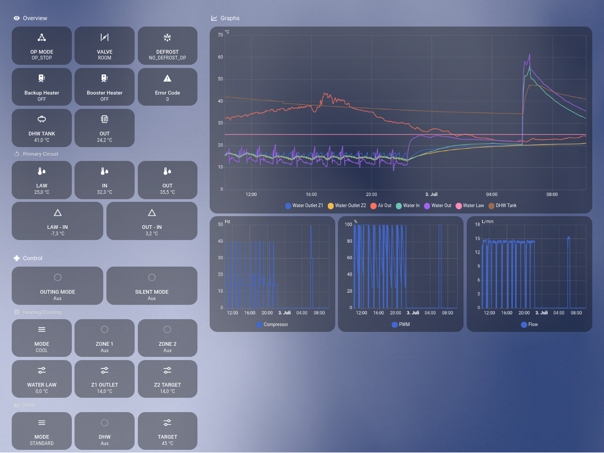

# Home Assistant Examples

This directory contains example configuration for using `tcp_hass_bridge` with Home Assistant, along
with screenshots used in the documentation.

## Files

| File | Description |
|---|---|
| [`example-dashboard.yaml`](example-dashboard.yaml) | Dashboard shown above: operating state, temperatures, energy, COP and controls |
| [`example-sensors.yaml`](example-sensors.yaml) | Additional sensors used by the dashboard (statistics, utility meters, templates) |
| `example-dashboard.png` | Screenshot of the Home Assistant dashboard |
| `web-dashboard.png` | Screenshot of the [nasa-web](../web/README.md) dashboard |

## Prerequisites

- `tcp_hass_bridge` is running and connected to the same MQTT broker as Home Assistant
  (see [APPS.md](../APPS.md#1-tcp_hass_bridge)).
- The [MQTT integration](https://www.home-assistant.io/integrations/mqtt/) is set up in Home Assistant.
  The bridge announces all entities through MQTT discovery under the device **Samsung EHS**, with
  entity IDs of the form `sensor.samsung_ehs_<name>`.

## Additional sensors

[`example-sensors.yaml`](example-sensors.yaml) derives further values from the bridge's entities:

| Sensor | Type | Description |
|---|---|---|
| Input / output energy last 1 h and 24 h | `statistics` | Energy consumed and produced in a sliding window |
| Daily input / output energy | `utility_meter` | Energy per day, reset at midnight |
| COP last 1 h, last 24 h, today | `template` | Heat produced ÷ electricity consumed |
| Water delta T, delta T2 | `template` | Flow minus return temperature, and water law target minus return temperature |
| Error filter | `filter` | Error code limited to values ≥ 0 |

Add the content to your `configuration.yaml`, or save the file as a
[package](https://www.home-assistant.io/docs/configuration/packages/), and restart Home Assistant.

## Dashboard

1. Add the sensors above first. The dashboard refers to them.
2. In Home Assistant, create a new dashboard, open it, and choose **Edit dashboard → ⋮ → Raw
   configuration editor**.
3. Replace the content with [`example-dashboard.yaml`](example-dashboard.yaml) and save.

If you changed entity names in the message lists, update the entity IDs in both files accordingly.
